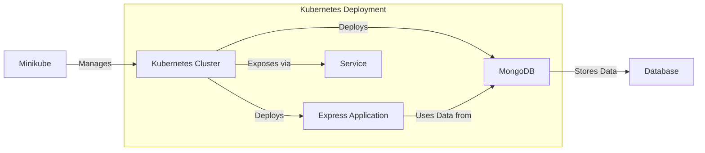

## Project Name
Kubernetes MongoDB Project



## Project Description
This project sets up a Kubernetes environment with MongoDB and mongo-express. MongoDB is a NoSQL database used for storing data, while mongo-express is a web-based MongoDB admin interface. The project uses Minikube for local Kubernetes cluster management and HyperKit as the hypervisor for running Minikube on macOS.

## Requirements
1. Minikube: To create a local Kubernetes cluster.
2. Kubectl: Command-line tool for interacting with Kubernetes clusters.
3. MongoDB: Database service.
4. mongo-express: Web-based interface for MongoDB.
5. HyperKit: Hypervisor used by Minikube on macOS.

## Installation Steps
1. Install Minikube and Kubectl
For macOS:

```bash
brew install minikube
brew install kubectl
```

For Linux
```bash
curl -LO https://storage.googleapis.com/minikube/releases/latest/minikube-linux-amd64
sudo mv minikube-linux-amd64 /usr/local/bin/minikube
sudo chmod +x /usr/local/bin/minikube

curl -LO "https://dl.k8s.io/release/v1.26.0/bin/linux/amd64/kubectl"
chmod +x ./kubectl
sudo mv ./kubectl /usr/local/bin/kubectl
```

2. Start Minikube with HyperKit
```bash
minikube start --driver=hyperkit
```

3. Create Kubernetes Configuration Files
Create a directory for your project and add the following files.

Directory Structure
```css
k8s-mongo-project/
├── mongo-deployment.yaml
├── mongo-service.yaml
├── mongo-express-deployment.yaml
├── mongo-express-service.yaml
└── README.md
```

mongo-deployment.yaml
```yaml
apiVersion: apps/v1
kind: Deployment
metadata:
  name: mongodb
  labels:
    app: mongodb
spec:
  replicas: 1
  selector:
    matchLabels:
      app: mongodb
  template:
    metadata:
      labels:
        app: mongodb
    spec:
      containers:
      - name: mongodb
        image: mongo:latest
        ports:
        - containerPort: 27017
        env:
        - name: MONGO_INITDB_ROOT_USERNAME
          value: "root"
        - name: MONGO_INITDB_ROOT_PASSWORD
          value: "password"
```

mongo-service.yaml

```yaml
apiVersion: v1
kind: Service
metadata:
  name: mongodb
spec:
  selector:
    app: mongodb
  ports:
  - protocol: TCP
    port: 27017
    targetPort: 27017
  type: ClusterIP
```


mongo-express-deployment.yaml

```yaml
apiVersion: apps/v1
kind: Deployment
metadata:
  name: mongo-express
  labels:
    app: mongo-express
spec:
  replicas: 1
  selector:
    matchLabels:
      app: mongo-express
  template:
    metadata:
      labels:
        app: mongo-express
    spec:
      containers:
      - name: mongo-express
        image: mongo-express:latest
        ports:
        - containerPort: 8081
        env:
        - name: ME_CONFIG_MONGODB_SERVER
          value: "mongodb"
        - name: ME_CONFIG_MONGODB_PORT
          value: "27017"
        - name: ME_CONFIG_MONGODB_ADMINUSERNAME
          value: "root"
        - name: ME_CONFIG_MONGODB_ADMINPASSWORD
          value: "password"
```

mongo-express-service.yaml

```yaml
apiVersion: v1
kind: Service
metadata:
  name: mongo-express
spec:
  selector:
    app: mongo-express
  ports:
  - protocol: TCP
    port: 8081
    targetPort: 8081
  type: LoadBalancer
```

4. Deploy to Kubernetes

```bash
kubectl apply -f mongo-deployment.yaml
kubectl apply -f mongo-service.yaml
kubectl apply -f mongo-express-deployment.yaml
kubectl apply -f mongo-express-service.yaml
```

5. Access mongo-express
To access mongo-express, you need to forward the service port to your local machine:

```bash
kubectl port-forward svc/mongo-express 8081:8081
```

Open your browser and navigate to http://localhost:8081 to access mongo-express.

## Notes
MongoDB and mongo-express are deployed as Kubernetes services and can be scaled or modified as needed.
The default username and password for MongoDB are set to root and password, respectively. Change these in the configuration files for production use.


This setup provides a basic local Kubernetes environment with MongoDB and mongo-express. For a production setup, consider additional security, persistence, and scaling configurations.
